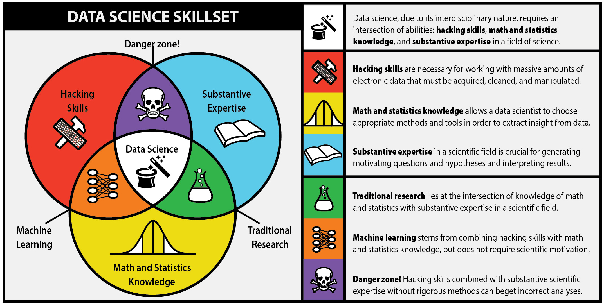
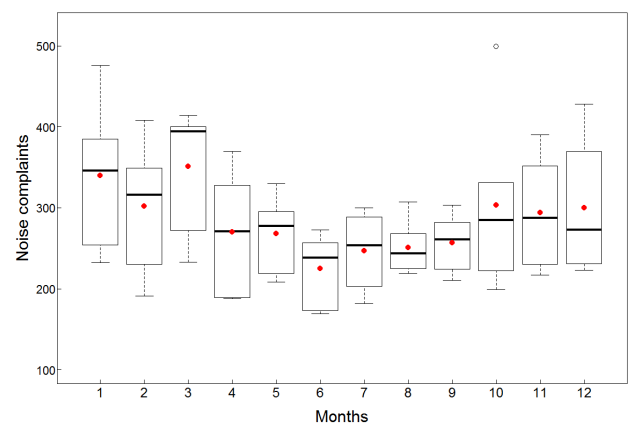

## ¿Qué haremos?

> - ¿Qué es la Acústica?

> - ¿Qué es la Ciencia de datos?

> - Ejemplos de Ciencia de datos aplicada a la Acústica: 

--- .segue bg:#3182bd
## ¿Qué es la Acústica?

--- &vcenter

--- &twocol w1:50% w2:50%
*** =left
> - 

> - 

*** =right
> - 

> - 

--- .segue bg:#9e9ac8
## ¿Qué es la Ciencia de Datos?

--- &vcenter

--- &vcenter

--- &vcenter

--- .segue bg:#33a02c
## Ejemplos de DS aplicada a la Acústica

--- &vcenter

--- &twocol w1:50% w2:50%
## 2012-2013
*** =left
> - <a href="https://www.researchgate.net/publication/243475053_Noise_Classification_of_Aircrafts_using_Artificial_Neural_Networks?_sg=Pnl-byt_l0pfEX8Okwv7bcF0x7V2BVTnZiANfKARJD9Uady-ij3W1nD_ltfkD6WbbFmb5XWxK64yUbRBHoVC-DycG2-BuvTojD5BB1Ct.ohWQWs5poq-rQhH8UsunBGN5W13Jo7PuUC_UwYuUR6sVHkPHSnzHibLTQYC9B-i8uSojCECBYjy2odrBWb91oQ" target="_blank">

</a>

*** =right
> - <a href="https://www.researchgate.net/publication/258998053_Desarrollo_de_un_algoritmo_para_la_deteccion_del_paso_de_aeronaves_Tesis?_sg=Pnl-byt_l0pfEX8Okwv7bcF0x7V2BVTnZiANfKARJD9Uady-ij3W1nD_ltfkD6WbbFmb5XWxK64yUbRBHoVC-DycG2-BuvTojD5BB1Ct.ohWQWs5poq-rQhH8UsunBGN5W13Jo7PuUC_UwYuUR6sVHkPHSnzHibLTQYC9B-i8uSojCECBYjy2odrBWb91oQ" target="_blank">

</a>

> - <a href="https://www.researchgate.net/publication/266384427_Integration_of_two_methods_to_detect_aircraft_noise_events_Inter_Noise_2013_-_not_submitted?_sg=Pnl-byt_l0pfEX8Okwv7bcF0x7V2BVTnZiANfKARJD9Uady-ij3W1nD_ltfkD6WbbFmb5XWxK64yUbRBHoVC-DycG2-BuvTojD5BB1Ct.ohWQWs5poq-rQhH8UsunBGN5W13Jo7PuUC_UwYuUR6sVHkPHSnzHibLTQYC9B-i8uSojCECBYjy2odrBWb91oQ" target="_blank">

</a>

--- &twocol w1:50% w2:50%
*** =left
> - 

> - 

*** =right
> - 

> - 

--- 

> - 

> - 

---
## Resumen 2012-2013

> - Datos: Niveles de presión sonora de monitoreos continuos

> - Referencia: Bitácora de vuelos del aeropuerto AMB

> - Problema de clasificación abordado con Redes neuronales artificiales (técnica de Machine Learning)

> - Herramienta de programación: Matlab

> - Resultado: Alta precisión para diferenciar entre despegues y aterrizajes (94%); además de la distinción entre grupos de modelos de aeronaves (96%)

> - Aplicación: Posibilidad de calibrar y calcular contribución exclusiva del aeropuerto en receptor específico y evaluar cumplimiento normativo

--- &vcenter

--- &vcenter
## 2015

<a href="https://www.researchgate.net/publication/280882977_Influence_of_road_traffic_noise_in_ischaemic_heart_disease_Introduction_to_the_issue_in_Santiago_of_Chile?_sg=Pnl-byt_l0pfEX8Okwv7bcF0x7V2BVTnZiANfKARJD9Uady-ij3W1nD_ltfkD6WbbFmb5XWxK64yUbRBHoVC-DycG2-BuvTojD5BB1Ct.ohWQWs5poq-rQhH8UsunBGN5W13Jo7PuUC_UwYuUR6sVHkPHSnzHibLTQYC9B-i8uSojCECBYjy2odrBWb91oQ" target="_blank">

</a>

--- &twocol w1:50% w2:50%
*** =left
> - 

> - 

*** =right
> - 

> - 

> - 

---
## Resumen 2015

> - Datos: Población potencialmente expuesta a ruido de tráfico vehicular según Mapa de ruido de Santiago 2011

> - Problema: Cruce con otras fuentes de datos (Esperanza de vida INE + Defunciones y Egresos hospitalarios del DEIS)

> - Problema: Proceso de datos (limpieza y orden) + Interpretación

> - Herramienta de programación: RStudio

> - Resultado: PAF Stgo 2011 = 4% (al nivel de EU en los 90)

> - Resultado: 351 casos atribuibles, 94 fallecieron + 185 DALYs

> - Aplicación: Cuantificación de efectos en salud y económicos. Reproducibilidad continua.

--- &vcenter

--- &vcenter
## 2016

<a href="https://www.researchgate.net/publication/303920437_Data_analysis_of_noise_complaints_in_Region_Metropolitana_Chile?_sg=Pnl-byt_l0pfEX8Okwv7bcF0x7V2BVTnZiANfKARJD9Uady-ij3W1nD_ltfkD6WbbFmb5XWxK64yUbRBHoVC-DycG2-BuvTojD5BB1Ct.ohWQWs5poq-rQhH8UsunBGN5W13Jo7PuUC_UwYuUR6sVHkPHSnzHibLTQYC9B-i8uSojCECBYjy2odrBWb91oQ" target="_blank">

</a>

--- &twocol w1:50% w2:50%
*** =left
> - 

> - 

*** =right
> - 

> - 

---
## Resumen 2016

> - Datos: Denuncias de ruido en Carabineros de Chile 2011-15 (RM)

> - Problema: Solicitud de datos vía Ley de Transparencia

> - Problema: Proceso de datos (limpieza y orden) + Interpretación

> - Problema: Cruce con otras fuentes de datos (Población de comunas INE + límites comunales de Mapoteca Congreso Nacional) + Visualización

> - Herramienta de programación: RStudio

> - Resultado: Diagnóstico + Propuesta de mejoras (formato de denuncias)

--- &vcenter

---
##  2018 y más...

> - Paper PAF + DALY + HSD para 3 ciudades + info. del mapa de Santiago actualizado

> - Proyecto para mejorar gestión de denuncias de ruido

> - En www.researchgate.net están todos los papers y códigos utilizados

> - Proyecto personal Dato Fútbol: www.datofutbol.cl

> - 

--- #b

